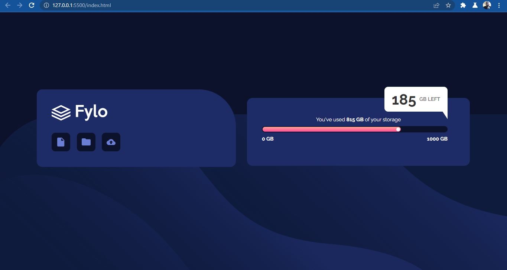
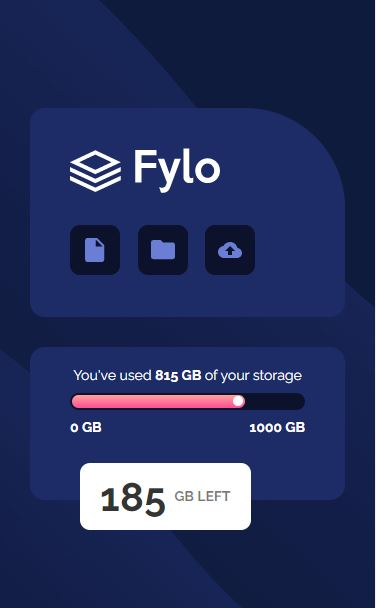

# Frontend Mentor - Fylo data storage component solution

This is a solution to the [Fylo data storage component challenge on Frontend Mentor](https://www.frontendmentor.io/challenges/fylo-data-storage-component-1dZPRbV5n). Frontend Mentor challenges help you improve your coding skills by building realistic projects. 

## Table of contents

- [Overview](#overview)
  - [The challenge](#the-challenge)
  - [Screenshot](#screenshot)
  - [Links](#links)
- [My process](#my-process)
  - [Built with](#built-with)
  - [What I learned](#what-i-learned)
  - [Continued development](#continued-development)
  - [Useful resources](#useful-resources)
- [Author](#author)
- [Acknowledgments](#acknowledgments)


## Overview

### The challenge

- Build out the project to the designs provided

### Screenshot







### Links

- Solution URL: [Add solution URL here](https://your-solution-url.com)
- Live Site URL: [Add live site URL here](https://your-live-site-url.com)

## My process

### Built with

- Semantic HTML5 markup
- CSS custom properties
- Flexbox


### What I learned

After going through some video tutorials on styling input[type=range], I discovered it was not the right direction. After giving a second thought on it, I discovered that the look alike slider was just made of divs. That was very creative you know making slider from divs.

```html
<body> 
  <div class="fylo__slider__container">
    <div class="fylo__slider">
        <div class="fylo__slider__thumb"></div>
    </div>
  </div>
</body>
```
```css
.fylo__slider__container{
    color: white;
    font-size: 1.4rem;
    font-weight: 600;
    width: 100%;
    max-width: 500px;
    height: 17px;
    padding: 2px;
    background-color: var(--vd--blue);
    border-radius: 10px;
    margin-bottom: 7rem;
    position: relative;
}

.fylo__slider {
    width: 75%;
    background: linear-gradient(var(--grad1), var(--grad2));
    height: 13px;
    border-radius: 10px;
    padding: 1.5px 2px;
}

.fylo__slider__thumb {
    height: 10px;
    width: 10px;
    background-color: white;
    border-radius: 50%;
    margin-left: auto;
}
```


### Continued development

Continuous working on my CSS styling

### Useful resources

A lot of resources was helpful not just in this project but from the beginning of my learning of web development.
- (https://www.w3schools.com) 

- (https://www.freecodecamp.com)

- (https://www.youtube.com)

- And lots more. Surely, I will always recommend them days in and days out


## Author

- Github - (https://github.com/SAAJEVES)
- Frontend Mentor - (https://www.frontendmentor.io/profile/SAAJEVES)
- Twitter - (https://www.twitter.com/saajeves)
- LinkedIn - (https://www.linkedin.com/in/samuel-ajagun-020283150)


## Acknowledgments

I would love to acknowledge a very good friend of mine (https://github.com/wisdomosara) for his immense contribution on helping me in this project. You are well appreciated.


